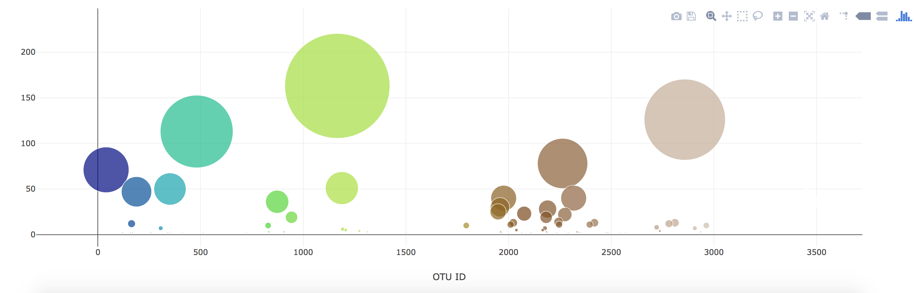

# Plot.ly Homework - Belly Button Biodiversity

In this assignment, I built an interactive dashboard to explore the [Belly Button Biodiversity dataset](http://robdunnlab.com/projects/belly-button-biodiversity/), which catalogs the microbes that colonize human navels.

The dataset reveals that a small handful of microbial species (also called operational taxonomic units, or OTUs, in the study) were present in more than 70% of people, while the rest were relatively rare.

## Step 1: Plotly

1. I used the D3 library to read in `samples.json`.

2. I created a horizontal bar chart with a dropdown menu to display the top 10 OTUs found in that individual.

* `sample_values` as the values for the bar chart.

* `otu_ids` as the labels for the bar chart.

* `otu_labels` as the hovertext for the chart.

  

3. I created a bubble chart that displays each sample.

* `otu_ids` for the x values.

* `sample_values` for the y values.

* `sample_values` for the marker size.

* `otu_ids` for the marker colors.

* `otu_labels` for the text values.

4. I displayed an individual's demographic information (metadata), based on the selected id from the dropdown menu.

5. I displaye each key-value pair from the metadata JSON object on the page.

6. The plots are updated any time that a new sample is selected.

## Advanced Challenge Assignment (Optional)

* I adapted the Gauge Chart from <https://plot.ly/javascript/gauge-charts/> to plot the weekly washing frequency of the individual.

* I modified the example gauge code to account for values ranging from 0 through 9.

* The chart updates whenever a new sample is selected.

## Deployment

* I deployed my dashbpard on GitHub Pages. .
